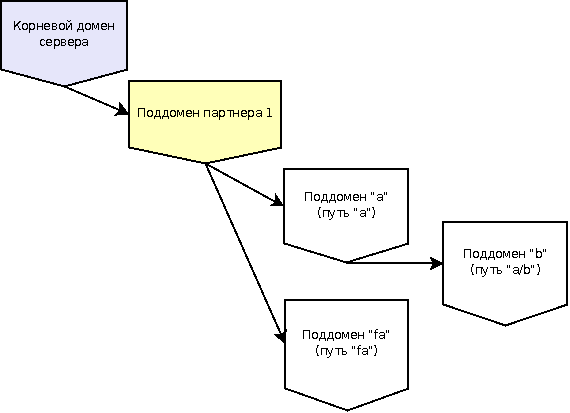
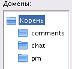
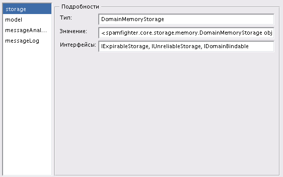

.. SpamFighter, Copyright 2008 NetStream LLC (http://netstream.ru/, we@netstream.ru)
.. This file is part of SpamFighter.
.. 
.. SpamFighter is free software: you can redistribute it and/or modify
.. it under the terms of the GNU General Public License as published by
.. the Free Software Foundation, either version 3 of the License, or
.. (at your option) any later version.
.. 
.. SpamFighter is distributed in the hope that it will be useful,
.. but WITHOUT ANY WARRANTY; without even the implied warranty of
.. MERCHANTABILITY or FITNESS FOR A PARTICULAR PURPOSE.  See the
.. GNU General Public License for more details.
.. 
.. You should have received a copy of the GNU General Public License
.. along with SpamFighter.  If not, see <http://www.gnu.org/licenses/>.
.. 

Основные компоненты сервера
===========================

В этом разделе описаны основные компоненты сервера, их функционирование, настройка,
взаимосвязи. 

.. index:: домен

.. _domain:

Домен
-----

Домен - это контекст выполнения любого запроса в рамках СпамоБорца. Домен представляет собой
просто набор пар вида: имя свойства, значение свойства. Свойствами домена могут быть простые
значения: числа, строки и т.п., так и более сложные элементы, являющиеся компонентами СпамоБорца:
:ref:`лог сообщений <message-log>`, :ref:`firewall <firewall>`.

У домена может быть *предок* (тоже являющийся доменом). Тогда операция получения свойства домена при отсутствии свойства
у данного домена будет обращаться с запросом к предку, так можно организовать наследование доменов:
домен-предок содержит свойства "по умолчанию", а домены-наследники (его дети) переопределяют
необходимые свойства, уточняя поведение сервера для различных ситуаций. Например, базовый домен определяет
свойства анализа сообщений для всего сайта, а поддомены-наследники конкретизируют эти свойства для 
различных видов общения (чат, личные сообщения и т.п.)

Домен может иметь *имя*, тогда он становится адресуемым относительно своего предка (аналогично адресуемости
каталогов в файловой системе). Относительного одного домена адрес другого может выглядеть так: ``a/b``, тогда
относительно текущего корневого домена мы должны взять потомка с именем ``a``, а у него потомка с именем ``b``.

Примеры
^^^^^^^

Пример дерева доменов:

В этом примере в корневому домену прикреплено три дочерних поддомена, каждый из которых отвечает за фильтрацию спама
в трех различных разделах сайта:

* *pm* - личные сообщения;
* *chat* - чат;
* *comments* - пользовательские комментарии.

Пример содержимого домена:

В данном домене находится:

* :ref:`хранилище данных <storage>` (storage);
* :ref:`модель анализа сообщений <model>` (model);
* :ref:`firewall <firewall>` (messageAnalyzer);
* :ref:`лог сообщений <message-log>` (messageLog).

Домен по умолчанию
^^^^^^^^^^^^^^^^^^

В системе существует *домен по умолчанию*, который является предком всех корневых доменов партнеров.
Домен по умолчанию может определять свойства, которые будут служить значениями по умолчанию для всех
поддоменов. Сам по себе домен по умолчанию недоступен для изменения, он не может быть адресован через
:ref:`api`.

.. index:: партнер

.. _partner:

Партнер
-------

Партнер - единица авторизации относительно сервера. Практически все запросы :ref:`api` требуют авторизации, т.е. указания
партнера, от имени которого выполняется запрос. Партнер может обладать функциональностью биллинга/аккаунтинга (т.е. вести
учет количества запросов к серверу и т.п.). Партнеры изолированы друг от друга, авторизовавшись под одним партнером нет
возможности повлиять на данные другого партнера.

Самое главное свойство партнера - его корневой :ref:`домен <domain>`, который определяет корень возможных контекстов
исполнения запросов. Любой запрос, выполненный от имени партнера, будет исполняться в его корневом домене или в доменах,
являющихся потомками корневого домена.

.. index::
   pair: авторизация; партнер

.. _authorize-provider:

Механизм авторизации партнеров
^^^^^^^^^^^^^^^^^^^^^^^^^^^^^^

Механизм авторизации партнеров определяет способ, которым по информации, переданной в :ref:`api`, определяется текущий
партнер для выполнения запроса.

.. _null-partner-authorizer:

Доверительный механизм авторизации
""""""""""""""""""""""""""""""""""

Доверительный механизм применяется для инсталляций, обслуживающих один проект, когда нет необходимости каким-то образом
авторизовать входящие запросы. В данной ситуации сервер СпамоБорец защищен от посторонних запросов либо сетевым firewall, 
либо дополнительным HTTP-proxy с возможностью блокировки по IP-адресу или HTTP-авторизацией.

В случае доверительного механизма авторизации существует всего один партнер, который определяет свой единственный корневой
домен. 

.. index:: сообщение

.. _message:

Сообщение
---------

Сообщение - единица передачи информации в СпамоБорец. Сообщение состоит из :ref:`атрибутов <message-attribute>`, набор которых,
типы и т.п., полностью настраиваются в рамках :ref:`домена <domain>`. Типичные атрибуты сообщения:

 * текст сообщения: чаще всего подвергается анализу различными методами;
 * ID пользователя, отправившего сообщение: может использовать при анализе на частоту отправки сообщений, для выявления и блокировки
   спамеров и т.п.;
 * другие атрибуты: e-mail отправителя, ник, логин, IP-адрес, данные об адресате сообщения, любая другая информация, которая может быть полезна
   для анализа сообщения.

Сообщение при передаче через :ref:`api` проходит через механизм сериализации, который, используя данные о типах атрибутов, осуществляет
корректное сохранение и восстановление сообщения.

.. table:: Пример сообщения

   ===========  ============================  ===========================================================
   
    Атрибут     Домен атрибута                 Значение атрибута
   ===========  ============================  ===========================================================
    text         Текстовый домен               "Ты не хочешь пойти сегодня погулять? Часиков в восемь?"
    fromID       Уник. целоцисленный домен     38
    fromIP       IP-адрес                      127.0.0.1
    fromEmail    E-mail                        bob@example.com
   ===========  ============================  ===========================================================

.. index::
   pair: сообщение; атрибут

.. _message-attribute:

Атрибут сообщения
^^^^^^^^^^^^^^^^^

Атрибут сообщения - составная часть :ref:`сообщения <message>`. Атрибут хранит свое значение, а также свой тип -
:ref:`домен атрибута <attribute-domain>`. Тип значения определяется доменом: для текстового домена это будет
строка, а для целочисленного, например, - число.

.. index::
   pair: домен; атрибут
   pair: сообщение; домен атрибута

.. _attribute-domain:

Домен атрибута сообщений
^^^^^^^^^^^^^^^^^^^^^^^^

Домен атрибута определяет тип :ref:`атрибута сообщения <message-attribute>`. Разнообразие доменов атрибутов
определяет возможные типы данных и смысл атрибутов сообщений. Домен может определять не только тип значения,
но и дополнительные логические характеристики (например, уникальность значения).

.. index::
   pair: текстовый; домен атрибута

Текстовый домен
"""""""""""""""

Текстовый домен используется обычно для передачи текста сообщения. Внутренняя кодировка хранения - Unicode, т.е.
СпамоБорец готов к обработке данных на любых языках. При передаче данных через :ref:`api` значение такого атрибута
обычно кодируется в кодировке UTF-8.

При десериализации атрибута текстового домена убираются пробельные символы в начале и в конце строки.

.. function:: TextAttributeDomain(name)

   :param name: имя атрибута

.. index::
   pair: целочисленный; домен атрибута

Целочисленный домен
"""""""""""""""""""

Целочисленный домен может использоваться для передачи различных чисел, связанных с сообщением или его адресатами
и адресантами. 

При передаче в :ref:`api` используется тип данных "число".

.. function:: IntAttributeDomain(name)

   :param name: имя атрибута

.. index::
   triple: уникальный; целочисленный; домен атрибута

Уникальный целочисленный домен
""""""""""""""""""""""""""""""

Уникальный целочисленный домен отличается от целочисленного только логической привязкой "уникальный", которая
определяет смысл атрибута. Данный домен может использоваться, например, для передачи ID пользователя - отправителя сообщения.

.. function:: UniqueIntAttributeDomain(name)

   :param name: имя атрибута

.. index::
   pair: домен; сообщение

.. _message-domain:

Домен сообщения
^^^^^^^^^^^^^^^

Домен сообщения - это набор :ref:`доменов атрибутов <attribute-domain>` :ref:`сообщения <message>`. Домен определяет
формат сообщений. Домен определяет возможный набор атрибутов сообщения, каждое сообщение может содержать лишь часть
перечисленных атрибутов (например, если данных недостаточно).

Домен сообщения хранится в :ref:`домене <domain>` в свойстве с именем ``messageDomain``. Наличие домена сообщения является
обязательным.

.. function:: MessageDomain(attributeDomain1, [...])
   
   В качестве параметров конструктора домен сообщения принимает список доменов атрибутов.

Пример:

.. code-block:: python

   MessageDomain(TextAttributeDomain("text"), UniqueIntAttributeDomain("fromID))

.. index:: модель анализа сообщений

.. _model:

Модель анализа сообщений
------------------------

Модель анализа сообщений осуществляет классификацию сообщений, выделяя в потоке сообщений, например,
спам, флуд, оскорбления, предложения интимного характера и т.п. классы. Работа модели основана на процессе
обучения. В режиме обучения модель получает образец исходных данных с необходимой пометкой - к какому
классу относится тот или иной элемент. После обучения модель готова на новых данных готова классифицировать
поступающие на вход данные.

Модель анализа сообщений поддерживает два условных класса: "хороший" (``good``) и "плохой" (``bad``). Интерпретация
классов зависит от задачи: одна модель может отвечать за классификацию "спам" - не-"спам", другая: "мат" - не "мат".
Модель стремится минимизировать ошибки классификации, связанные с классификацией "хорошего" сообщения как "плохого".
Модель в качестве исходных данных на вход принимает текст сообщения.

Модель анализа сообщений хранится в :ref:`домене <domain>` в свойствах с произвольным именем.

.. index::
   pair: модель анализа сообщений; Байес

Простая Байесовская модель (BayesModel)
^^^^^^^^^^^^^^^^^^^^^^^^^^^^^^^^^^^^^^^

Простая Байесовская модель основана на теореме Байеса [#Bayes]_. Данная модель не имеет практической ценности,
т.к. состояние модели (обучения) не сохраняется, а находится лишь в оперативной памяти и при перезапуске сервера
пропадает. 

.. function:: BayesModel()

.. index::
   pair: модель анализа сообщений; data mining

DataMining-модель (DataMiningModel)
^^^^^^^^^^^^^^^^^^^^^^^^^^^^^^^^^^^

Данная модель построена на принципах интеллектуального анализа данных [#DataMining]_. Она обладает хорошей возможностью
к обучению, высокой эффективностью и точностью классификации.

.. note::

   Данная модель доступна только в Pro-варианте СпамоБорца.

.. function:: DataMiningModel()

.. index:: хранилище данных

.. _storage:

Хранилище данных
----------------

Хранилище данных используется для хранения данных в рамках :ref:`домена <domain>`. Хранилище предоставляет
абстракцию коллекции пар (ключ, значение), при этом каждый ключ может иметь срок годности (предельное время
хранения). Хранилище может обладать разными характеристиками по скорости доступа, отношения к перезапуску (надежность),
а также к распределенному использованию.

Хранилище в памяти (DomainMemoryStorage)
^^^^^^^^^^^^^^^^^^^^^^^^^^^^^^^^^^^^^^^^

Данные такого хранилища хранятся в оперативной памяти сервера, теряются при перезапуске сервера. Может использоваться
для хранения ключей с малым временем жизни, использующихся, например, при анализе частоты отправки сообщений за 
небольшой промежуток времени (полчаса и меньше).

.. function:: DomainMemoryStorage()

Хранилище на диске (DomainedDBMStorage)
^^^^^^^^^^^^^^^^^^^^^^^^^^^^^^^^^^^^^^^

Хранилище на диске обеспечивает постоянное, надежное хранение информации на локальном диске сервера, на котором
работает СпамоБорец. Содержимое хранилища не теряется при перезапуске сервера. Скорость доступа ниже, чем у хранилища
в памяти.

.. function:: DomainedDBMStorage()

.. index::
   single: правило
   pair: правило; анализ

.. _rules:

Правила
-------

Правила анализа сообщений выполняют основную работу по анализу сообщений, они применяются в рамках
работы :ref:`firewall <firewall>` к сообщениями относительно текущего домена. Вызов правила синтаксически
совпадает с вызовом правила: у правила есть имя, а также набор именованных параметров.

Таким образом, каждое правило в качестве неявного параметра получает сообщение и домен, относительно
которого происходит анализ данного сообщения. Домен используется правилами для получения дополнительных
параметров настройки, дополнительных компонентов, например, хранилищ данных.

.. index::
   pair: правило; модель

Правила, связанные с моделью анализа сообщений
^^^^^^^^^^^^^^^^^^^^^^^^^^^^^^^^^^^^^^^^^^^^^^

Все правила этого раздела принимают в качестве параметра имя модели анализа сообщения, сама модель
должна быть доступна через текущий домен.

.. index::
   triple: правило; модель; modelClassify

.. function:: modelClassify(model="model", attribute="text')

   Классифицировать сообщение с помощью модели анализа сообщения. 

   Правило через домен обращается к модели с указанными именем, из сообщения
   берет значение текстового атрибута (текст сообщения), после чего текст сообщения
   передается модели на классификацию. Если модель классифицирует данное сообщение
   как "хорошее", правило возвращает истину, иначе - ложь.

   :param model: имя модели анализа сообщений в текущем домене
   :param attribute: имя атрибута сообщения, содержащего текст сообщения, который и будет передан модели
   :returns: истина, если модель классифицирует текст сообщения как "хороший", и ложь, если наоборот

.. index::
   triple: правило; модель; modelTrain

.. function:: modelTrain(model="model", attribute="text", marker="good")

   Обучить модель анализа сообщений на тексте сообщения, указав категорию сообщения: "плохое" или "хорошее".

   Правило через домен обращается к модели с указанным именем, из сообщения
   берет значение текстового атрибута (текст сообщения), который передается в модель
   анализа сообщений на обучение, модель обучается на указанном тексте в соответствие со значением
   маркера: хорошее это сообщение или плохое.

   Правило всегда истинно.

   :param model: имя модели анализа сообщений в текущем домене
   :param attribute: имя атрибута сообщения, содержащего текст сообщения, который и будет передан модели
   :param marker: классификация сообщения для модели: "good" - хорошее или "bad" - плохое
   :returns: истина

.. index::
   pair: правило; лог сообщений

Правила, связанные с логом сообщений
^^^^^^^^^^^^^^^^^^^^^^^^^^^^^^^^^^^^

.. index::
   triple: правило; лог сообщений; messageLogPut

.. function:: messageLogPut(log="messageLog", tag=None)
   
   Положить сообщение с текущим набором тегов в лог.

   Правило находит в домене лог сообщений с указанным именем и помещает в него сообщение. Вместе с сообщением
   в лог записываются тэги, которые были присвоены сообщению предыдущими действиями :ref:`firewall <firewall>`.
   С помощью параметра tag можно добавить к записи в логе (не с самому сообщению) дополнительный тэг.

   Правило всегда истинно.

   :param log: имя лога сообщений в текущем домене
   :param tag: имя тэга, дополнительно дописываемого к записи в логе
   :returns: истина

.. index::
   pair: правило; валидация

Правила валидации
^^^^^^^^^^^^^^^^^

Правила данного раздела осуществляют проверки сообщения на валидность (длину, регулярное выражение и т.п.)

.. index::
   triple: правило; валидация; regexpCheck
   pair: правило; regexp
   pair: правило; регулярное выражение

.. function:: regexpCheck(regexp, attribute="text")

   Правило применяет к значению текстового атрибута сообщения указанное регулярное выражение,
   результатом правила является успешность применения выражения.

   :param regexp: регулярное выражение, синтаксис Python, например: ``.*lala{2,3}(|bcd)``
   :param attribute: имя атрибута сообщения, содержащего текст сообщения
   :returns: результат применения регулярного выражения: соответствует текст ему или нет

.. index::
   triple: правило; валидация; lengthCheck
   pair: правило; длина

.. function:: lengthCheck(minLength=None, maxLength=None, attribute="text")

   Правило проверяет длину текстового атрибута сообщения.

   Правило берет из сообщения текстовый атрибут с указанным именем и сравнивает его длину
   с указанными пределами (``minLength`` и ``maxLength``). Если параметр ``minLength`` задан и длина
   текстового атрибута меньше ``minLength``, правило вернет "ложь". Аналгично, если задан ``maxLength``
   и длина значения атрибута больше ``maxLength``, правило вернет "ложь". Во всех остальных
   случаях результатом вычисления будет "истина".

   :param minLength: минимальная длина значения атрибута или ``None``, если не надо осуществлять проверку
                     на минимальную длину
   :param maxLength: максимальная длина значения атрибута или ``None``, если не надо осуществлять проверку
                     на максимальную длину
   :param attribute: имя атрибута сообщения, содержащего текст сообщения

.. index::
   triple: правило; валидация; attributeCheck

.. function:: attributeCheck(attribute, value)

   Правило проверяет соответствие значения атрибута сообщения указанному значению.

   Т.е. правило выполняет проверку вида: ``message.attribute == value ?``

   :param attribute: имя атрибута сообщения
   :param value: проверяемое значение атрибута
   :returns: истина, если значение атрибута совпадает с указанным значением

.. index::
   triple: правило; валидация; hasAttribute

.. function:: hasAttribute(attribute)

   Правило проверяет наличие указанного атрибута у сообщения

   :param attribute: имя атрибута сообщения
   :returns: истина, если у сообщения имеется указанный атрибут

Правила анализа текста сообщений
^^^^^^^^^^^^^^^^^^^^^^^^^^^^^^^^

Данная группа осуществляет проверку текста сообщений.

.. index::
   pair: правило; messageFloodCheck
   pair: правило; flood
   pair: правило; флуд

.. function:: messageFloodCheck(attribute='text', minLength=16, minMean=1.5, maxVariance=2.0)

   Правило анализирует значение текстового атрибута сообщение на флуд. Под флудом понимается отправка большого
   количества похожих фраз в тексте сообщения.

   Алгоритм работы:
   Текст сообщения разбивается на триграммы (например для фразы "привет андрей!" будут составлены следующие триграммы: "при", "рив", "иве", "вет",
   "ета", "тан", "анд", "ндр", "дре", "рей", "ей!"), и подсчитывается количество вхождений каждой триграммы. В результате получается
   последовательность чисел, для которой рассчитывается значение математического ожидания и дисперсии. Сообщение будет считаться флудом
   (возвращаемое значение "ложь"), если значение математического ожидания меньше ``minMean``, а значение дисперсии больше ``maxVariance``.

   Если длина сообщения меньше ``minLength``, правило вернет "истину" (анализ коротких сообщений может дать большую погрешность при рассчете
   математического ожидания и дисперсии).

   При запуске на тестовой базе, содержащей нормальные сообщения, из 16674 сообщений правило не заблокировала ни одного сообщения.
   При запуске на тестовой базе, содержащей флуд, из 1477 было обнаружено 956 сообщений, содержащих флуд, что составляет 65% от общего числа сообщений.

   :param attribute: имя атрибута сообщения, содержащего текст сообщения
   :param minLength: минимальная длина значения атрибута
   :param minMean: минимальное значение математического ожидания появления триграмма
   :param maxVariance: максимальное значение дисперсии

Правила проверки на частоту
^^^^^^^^^^^^^^^^^^^^^^^^^^^

Данная группа осуществляет проверку на частоту (скорость) тех или иных событий, ограничивая, например,
число сообщений в секунду.

.. index::
   pair: правило; messageFrequencyCheck

.. function:: messageFrequencyCheck(attribute="text", storage="storage", timeout=300, count=3, minLength=10)

   Проверка на частоту отправки сообщений с одним и тем же (или похожим) текстом. 

   Правило берет значение текстового атрибута сообщения. Проверка выполняется, если его длина больше ``minLength`` символов.
   Далее текст сообщения нормализуется (убираются пробельные символы, символы переводятся в нижний регистр). От полученной
   строки вычисляется md5-хэш. Полученный хэш используется для сравнения сообщений, если хэши равны, то считается, что
   и сообщения равны.

   Правило проверяет, что в течение ``timeout`` секунд не было отправлено более ``count`` сообщений с одним и тем же 
   хэшом. Если количество отправленных сообщений превышает ``count``, правило возвращает "ложь", иначе "истину".

   :param attribute: имя атрибута сообщения, содержащего текст сообщения
   :param storage: имя свойства домена, содержащего хранилище, которое используется правилом для хранения информации
   :param timeout: анализируемый на частоту отправки период времени, секунды
   :param count: максимальное число отправляемых в течение ``timeout`` секунд сообщений с одинаковым хэшом
   :param minLength: минимальная длина сообщения, при достижении которого правило начинает работать

.. index::
   pair: правило; userFrequencyCheck

.. function:: userFrequencyCheck(attribute="from", storage="storage", timeout=300, count=3)

   Проверка на частоту отправки сообщений одним пользователем (или группой пользователей).

   Группа или пользователь определяются атрибутом сообщения с именем ``from``. Значением этого атрибута,
   может быть, например, ID пользователя, отправившего сообщение. Правило проверяет, что в течение
   ``timeout`` секунд не было отправлено более ``count`` сообщений с одним и тем же значением атрибута
   ``from``.

   :param attribute: имя атрибута сообщения, которое определяет отправителя сообщения
   :param storage: имя свойства домена, содержащего хранилище, которое используется правилом для хранения информации
   :param timeout: анализируемый на частоту отправки период времени, секунды
   :param count: максимальное число отправляемых в течение ``timeout`` секунд сообщений с одинаковым ``from``

Правила, используемые для тестирования
^^^^^^^^^^^^^^^^^^^^^^^^^^^^^^^^^^^^^^

Правила этой группы могут использоваться для целей отладки, тестирования сервиса.

.. index::
   pair: правило; ruleTrue

.. function:: ruleTrue()

   :returns: истина

.. index::
   pair: правило; ruleFalse

.. function:: ruleFlase()

   :returns: ложь

.. index::
   single: firewall

.. _firewall:

Firewall
--------

Firewall определяет цепочку действий, которые выполняются над входящим сообщением. Результат выполнения
действий firewall - результат анализа, строка, которая классифицирует сообщение (спам, флуд и т.п.) Сообщение
с дополнительными метками (тэгами) проходит через цепочку действий firewall, при этом к сообщению
добавляются новые метки (тэги), а на выходе из firewall формируется окончательное решение - результат анализа.

.. index::
   pair: синтаксис; firewall

Синтаксис действий firewall
^^^^^^^^^^^^^^^^^^^^^^^^^^^

.. productionlist::
   firewall: `rule`+
   rule: [`label` ":"] [`if_condition`] `statement`
   label: "0-9"+
   if_condition: "if" ["not"] `tags_list`
   statement: `do_statement` | `skip_statement` | `stop_statement`
   do_statement: "do" `rule_call` ["mark" `tags_list`]
   skip_statement: "skip" "to" `label`
   stop_statement: "stop" "as" `decision`
   tags_list: `tag` (, `tag`)*
   rule_call: `rule_name` "(" `rule_param` (, `rule_param`)*  ")"
   rule_param: `rule_param_name` "=" `rule_param_value`
   tag: "A-z0-9"+
   decision: "A-z0-9"+
   rule_name: "A-z0-9"+
   rule_param_name: "A-z0-9"+
   rule_param_value: """ "string" """ | "0-9"+

Набор действий firewall состоит из отдельных действий, каждое из которых располагается на новой строке. К каждому 
действию слева может быть добавлена числовая метка `label`. Действие может начинаться с условия `if`,
тогда в зависимости от тэгов сообщения, действие может быть выполнено или пропущено.

Существует три вида действий:

* действие `do` осуществляет применение :ref:`правила <rules>` к сообщению, и, в зависимости от результатов выполнения правила,
  привязывает к сообщению дополнительные метки;
* действие `skip` осуществляет переход вниз по цепочке действий к действию с указанной меткой, пропуская часть
  действий;
* действие `stop` останавливает работу firewall, указывая сформировавшийся результат анализа - решение, принятое
  firewall.

Действие do
"""""""""""

.. productionlist::
   do_statement: "do" `rule_name` "(" `rule_param` (, `rule_param`)*  ")" ["mark" `tags_list`]

Действие `do` выполняет :ref:`правило <rules>` и, в зависимости от результата выполнения правила, дописывает к сообщению
указанные тэги. Выполнение правила также может иметь побочный эффект (например, запись сообщения в :ref:`лог сообщений <message-log>`).

Вызов правила синтаксически похож на вызов функции с набором именованных параметров. В соответствие с набором документированных
параметров правила, в действии `do` можно указать аргументы правила с их значениями или оставить им значения по умолчанию, например::

   lengthCheck(minLength=3)

Такое обращение приведет к вызову правилу `lengthCheck` с параметрами (неуказанные явно параметры приняли значения по умолчанию)::

   minLength=3, maxLength=None, attribute="text"

Если результатом вычисления правила будет **ложь** и в правиле присутствует ``mark``-часть, то теги из списка ``tags_list`` будут 
присоединены к текущему списку тэгов сообщения.

Рассмотрим пример. На входе в firewall у сообщения пустой набор тэгов - ``[]``. После выполнения правила::

   do ruleFalse() mark a, b

У сообщения набор тэгов станет таким: ``[a, b]``. 

После выполнения правила::

   do lengthCheck(minLength=3) mark tooshort

Если длина текста сообщения меньше 3 символов к сообщению добавится тэг ``tooshort``: ``[a, b, tooshort]``, а если длина 
текста больше либо равна 3 символам, набор тэгов не изменится.

Действие skip
"""""""""""""

.. productionlist::
   skip_statement: "skip" "to" `label`

Действие `skip` пропускает действия firewall до тех пор, пока не найдется действие, метка которого будет равна ``label``. Поиск 
осуществляется только вниз, то есть возвратов "назад" этим правилом организовать нельзя. В случае, если действия с указанной
в правиле `skip` не найдется, такая ситуация считается ошибочным выполнением firewall.

Например::

   skip to 10
   do messageLogPut()
   10: doLengthCheck(maxLength=1000) mark toolong

При таком наборе действий второе действие (``do messageLogPut()``) не будет никогда выполняться, т.к. первое действие осуществляет
безусловный переход к третьему.

Действие stop
"""""""""""""

.. productionlist::
   stop_statement: "stop" "as" `decision`

Действие `stop` останавливает выполнение набора действий firewall, возвращая ``decision`` в качестве результата выполнения firewall.

Например::

   stop as OK

Остановить выполнение firewall, вернуть ``"OK"`` в качестве результата выполнения.

Условие if
""""""""""

Условие ``if`` может быть присоединено слева к любому из вышеописанных действий.

.. productionlist::
   if_condition: "if" ["not"] `tags_list`

Условие позволяет выключить выполнения действий для определенной комбинации тэгов проходящего через действие сообщения.
Условие ``if`` позволить выполнить действие, если у сообщения есть все тэги из списка ``tags_list``, а условие ``if not``
позволит выполнить действие, если у сообщения нет ни одного тэга из списка ``tags_list``.

Например::

  do lengthCheck(minLength=3) mark tooshort
  if not tooshort do messageLogPut()

В лог сообщений не попадут слишком короткие сообщения.

Примеры наборов действий
^^^^^^^^^^^^^^^^^^^^^^^^

Пустой набор действий не считается валидным для firewall, при его обработке будет получен результат ``UNKNOWN``. Если все
действия firewall выполнены, и не встретилось по пути ни одного действия ``stop``, результатом выполнения будет также ``UNKNOWN``.

Если выполнения какого либо правила привело к ошибке или при выполнении действия ``skip`` не было найдено действие с соответствующей
меткой, выполнение firewall считается ошибочным и клиенту возвращается ошибка.

Пример::

   do lengthCheck(minLength=1, maxLength=1000) mark invalid
   if invalid skip to 1000
   do messageFrequencyCheck() mark messagefrequent, frequent
   do userFrequencyCheck() mark userfrequent, frequent
   if frequent skip to 1000
   do modelClassify() mark spam
   1000: do messageLogPut()
   if invalid stop as INVALID
   if frequent stop as FREQUENT
   if spam stop as SPAM
   stop as OK

Содержимое домена для выполнения такого набора правил:

 * ``storage``: ``DomainMemoryStorage``
 * ``messageDomain`` : ``MessageDomain(TextAttributeDomain("text"), UniqueIntAttributeDomain("from"))``
 * ``messageAnalyzer`` : firewall с приведенными выше правилами
 * ``messageLog`` : ``MessageLog()``
 * ``model`` : ``BayesModel()``

.. index:: лог сообщений
   pair: лог; сообщение

.. _message-log:

Лог сообщений
-------------

Лог сообщений позволяет сохранить на какое-то время сообщения, прошедшие через :ref:`firewall <firewall>` вместе с тэгами,
которые были им присвоены. Сам лог сообщений хранится в :ref:`домене <domain>`, являясь его свойством.

.. function:: MessageLog(storage="storage", timeChunk=10, numChunks=100)

   :param storage: имя свойства домена, в котором находится :ref:`хранилище <storage>`
   :param timeChunk: емкость одного ключа хранилища в секундах
   :param numChunks: количество выделяемых в хранилище ключей

Лог сообщений является кольцевым логом, который хранит сообщения за последние ``timeChunk*(numChunks-1)`` секунд
в указанном хранилище. По запросу клиента лог может вернуть произвольное подмножество сохраненных записей.

При записи в лог каждое сообщение получает ID, который увеличивается с каждым новом сообщением, и является
уникальным в пределах данного лога сообщений.

.. [#Bayes]        http://ru.wikipedia.org/wiki/Теорема_Байеса
.. [#DataMining]   http://ru.wikipedia.org/wiki/Data_mining
