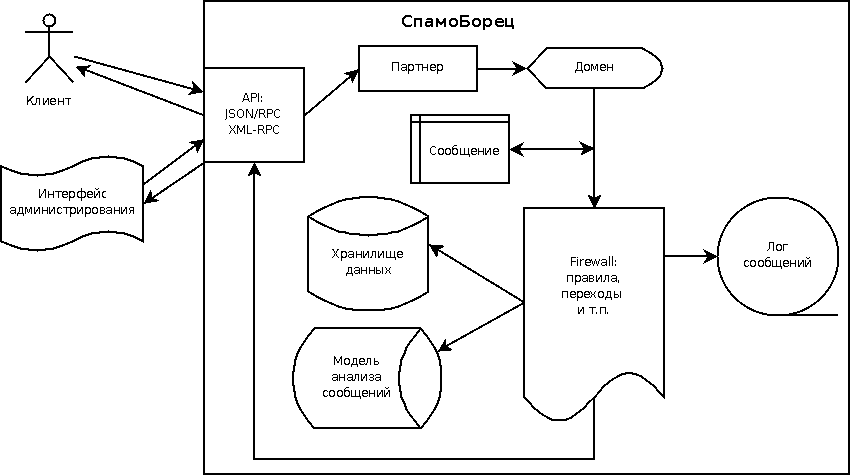

.. SpamFighter, Copyright 2008 NetStream LLC (http://netstream.ru/, we@netstream.ru)
.. This file is part of SpamFighter.
.. 
.. SpamFighter is free software: you can redistribute it and/or modify
.. it under the terms of the GNU General Public License as published by
.. the Free Software Foundation, either version 3 of the License, or
.. (at your option) any later version.
.. 
.. SpamFighter is distributed in the hope that it will be useful,
.. but WITHOUT ANY WARRANTY; without even the implied warranty of
.. MERCHANTABILITY or FITNESS FOR A PARTICULAR PURPOSE.  See the
.. GNU General Public License for more details.
.. 
.. You should have received a copy of the GNU General Public License
.. along with SpamFighter.  If not, see <http://www.gnu.org/licenses/>.
.. 

Обзор возможностей СпамоБорца
=============================

СпамоБорец предоставляет :ref:`API <api>`, с помощью которого клиенты, используя протокол HTTP и любой из
протоколов XML-RPC/JSON-RPC, могут отправлять запросы к серверу. 

На рисунке изображена схема обслуживания основной команды API, :ref:`sf.message.input <sf.message.input>`, которая отправляет
:ref:`сообщение <message>` на обработку в сервер СпамоБорца. По запросу API определяется :ref:`партнер <partner>`,
от имени которого выполняется команда (авторизация), а с помощью партнера - и :ref:`домен <domain>`, относительно
которого происходит обработка запроса.

Сообщение относительно домена проходит десериализацию с помощью :ref:`домена сообщений <message-domain>`.
В домене находится :ref:`firewall <firewall>`, который определяет порядок обработки сообщений, набор :ref:`правил <rules>`,
которые будут применены к сообщению. Правила в процессе своей работы могут обращаться к :ref:`моделям анализа сообщений <model>`,
:ref:`хранилищам данных <storage>`, а также другим компонентам СпамоБорца. В конце обработки сообщение помещается
в :ref:`лог сообщений <message-log>` для контроля работы набора правил. Результат анализа отправляется через API обратно
к клиенту.

