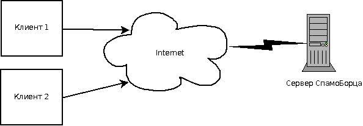
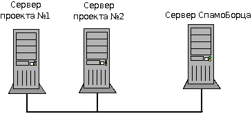

.. SpamFighter, Copyright 2008 NetStream LLC (http://netstream.ru/, we@netstream.ru)
.. This file is part of SpamFighter.
.. 
.. SpamFighter is free software: you can redistribute it and/or modify
.. it under the terms of the GNU General Public License as published by
.. the Free Software Foundation, either version 3 of the License, or
.. (at your option) any later version.
.. 
.. SpamFighter is distributed in the hope that it will be useful,
.. but WITHOUT ANY WARRANTY; without even the implied warranty of
.. MERCHANTABILITY or FITNESS FOR A PARTICULAR PURPOSE.  See the
.. GNU General Public License for more details.
.. 
.. You should have received a copy of the GNU General Public License
.. along with SpamFighter.  If not, see <http://www.gnu.org/licenses/>.
.. 

********
Введение
********

Сервер СпамоБорца предоставляет услуги по фильтрации входящих сообщений и выявлению в них спама, мата, флуда
и прочих нежелательных элементов. 

Варианты размещения
===================

Сервер может быть расположен удаленно по отношению к использующим
его клиентам, в этой ситуации клиенты отправляют запросы серверу через сеть:

Такой вариант использования подойдет для относительно небольших проектов. Вы можете воспользоваться нашей
инсталляцией СпамоБорца, которая поддерживается и обновляется нами. Если число обращений в сутки к серверу
СпамоБорца будет меньше 2000, такое подключение производится бесплатно.

Или же сервер может быть расположен локально с сети кластера серверов проекта:

При такой установке вам потребуется установить СпамоБорец на один или несколько серверов, запустить его
и поддерживать. Мы можем предоставить услуги по установке, поддержке и настройке СпамоБорца на ваших
серверах.

